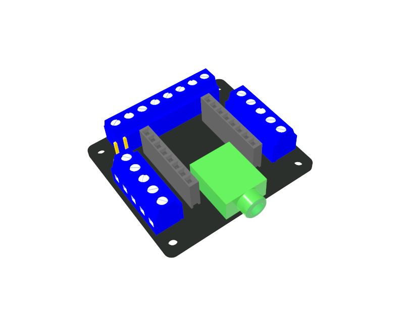
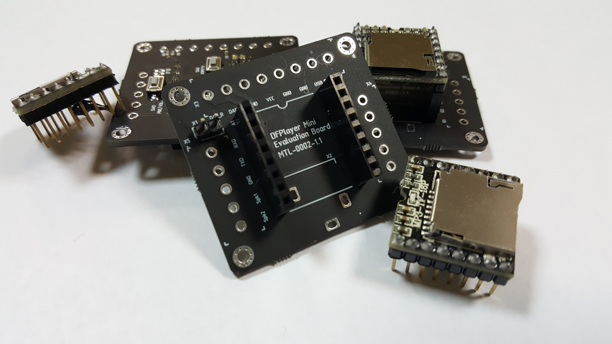
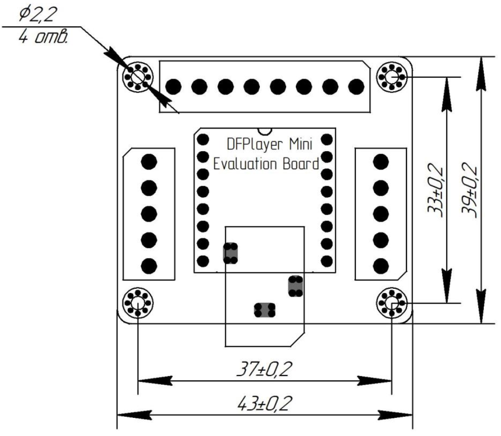

Шилд для DFPlayer, позволяет удобным образом интегрировать его в крупные проекты или же просто использовать как плеер.

Разрабочик: Иван Устюгов

## Особенности:
- габаритные размеры 43x39x12 мм;
- все сигнальные линии модуля «DFPlayer Mini» выведены на клеммники винтовые;
- на линии питания установлен фильтр;
- стереовыход ЦАП подключен через аудио разъем («SJ1-3513»);
- предустановлены 4 кнопки, функционал двух из которых настраивается (путем замены резисторов R2 и R3 с типоразмером 0603);
- возможность работы линии RX с сигналом высокого уровня в 3,3 В и 5 В

