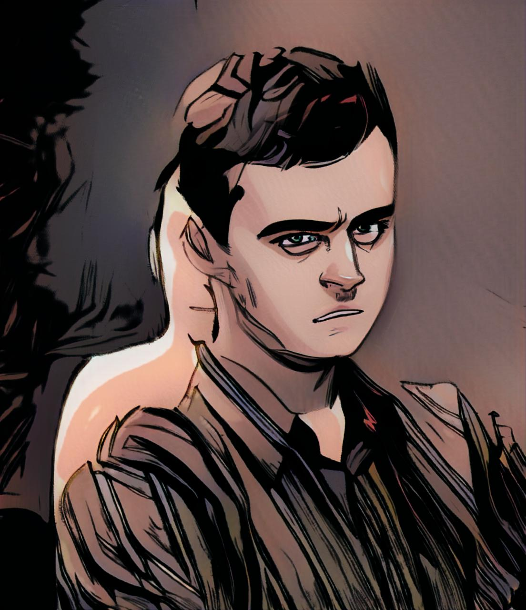

---
---

# О нас

Лаборатория "MT.lab" была образована в 2012 году инициативной группой преподавателей и студентов на базе робокружка кафедры Мехатроники. Основной целью на момент открытия было создание для студентов, даже для первокурсников, возможности пообщаться “с железками” и с пользой провести свободное время в университете.

Совмещаемые с учебой занятия в лаборатории позволяли многим студентам применить полученные знания при подготовке к студенческим соревнованиям и выставкам в России и за рубежом.

В 2014 году стартует пробный набор старшеклассников на курсы "MT.lab Junior". Это позволило частично сформировать и круг заинтересованных в дальнейшем обучении абитуриентов, поступающих на кафедру.

По истечению нескольких лет активной жизни при поддержке кафедры сформировался и постоянный состав участников лаборатории. А в 2018 году, после ликвидации кафедры, было решено продолжить исследования и работу над интересными для участников проектов вне стен университета.

Среди областей наших интересов можно назвать все, что объединяет слово “Мехатроника”: механику, электронику и программирование. Для более подробного ознакомления Вы можете перейти на страницу наших проектов.

Исторически, у лаборатории никогда не было направления деятельности, которое можно было бы назвать основным.

# Кто мы?

## На данный момент активно принимают участие:
<table style="width:40%">
    <tr>
        <td style="width:20% align:center">
            Куприянов
        </td>
        <td style="width:20% align:center">
        </td>
    </tr>
    <tr>
        <td>
        
        </td>
        <td>
            Сайт 
            Второй сайт 
            почта 
            телега 
             
            <h2>Проекты:</h2>
            <ul>
                <li>MT.Session</li>
            </ul>
        </td>
    </tr>
</table>
 Немного о себе

## В какой-то момент значительный вклад в деятельность лаборатории внесли

Аналогичная таблица?
