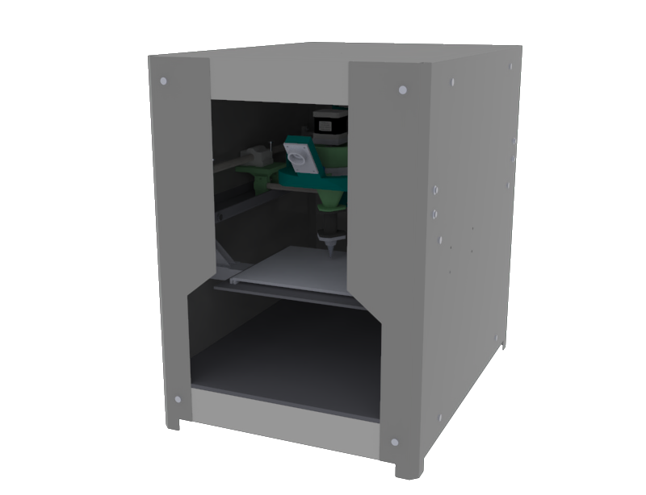

Cистема фигурного нанесения глазури с обратной связью

# Планируемые особенности:
- подача глазури посредством шнекового насоса
- специальный слайсер преобразует dwg в траекторию нанесения глазури (нет послойной печати)
- сканер создаёт модель получившегося глазурного узора с точностью +/- 1 мм
- система контроля качества анализирует качество выполнения рисунка
- возможно подключение нескольких устройств в сеть и одновременное управление ими с центральной станции
