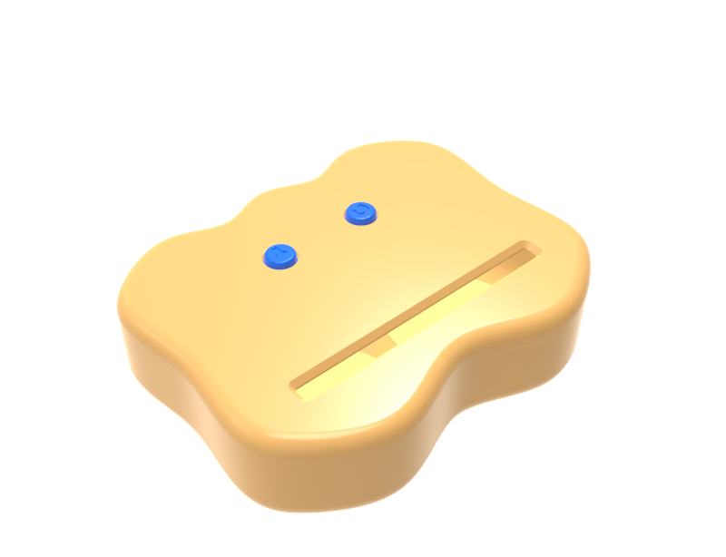
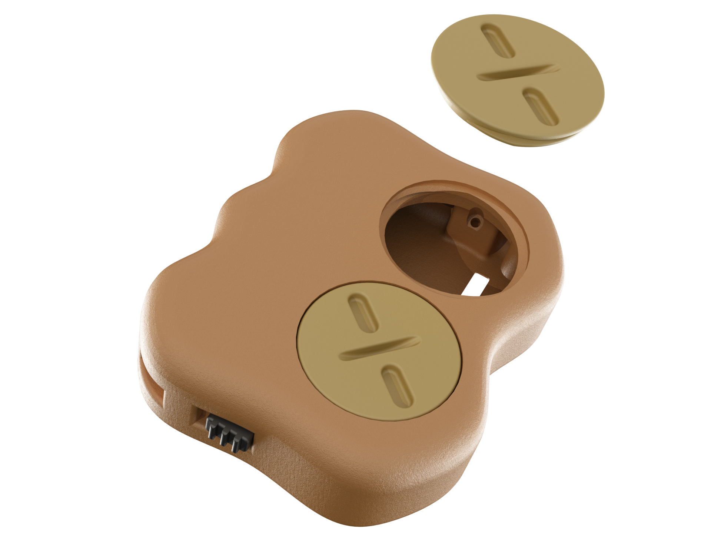
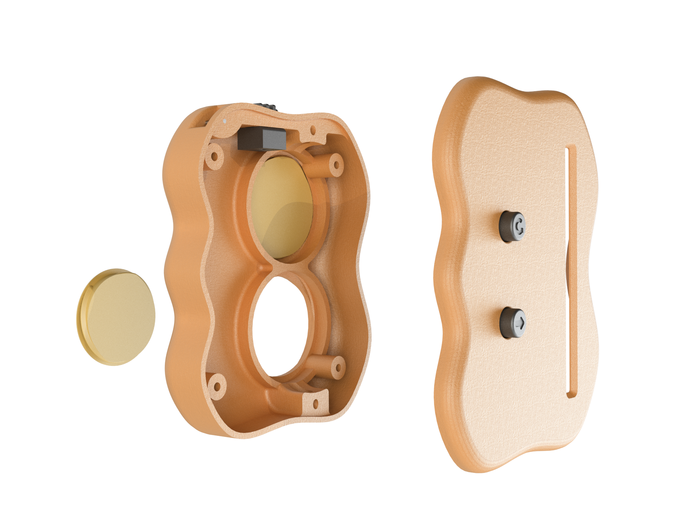

Стробоэкран для различных областей применения

Разрабочик: Иван Устюгов

Устройство питается от двух батареек

В конструкции предусмотрены тумблер питания и 2 функциональные кнопки

Начинался он так

А теперь выглядит вот так

Видео с примером работы

    <iframe class="embed-youtube" src="https://www.youtube-nocookie.com/embed/SQGu-6eci5k" frameborder="0" allow="accelerometer; autoplay; clipboard-write; encrypted-media; gyroscope; picture-in-picture" allowfullscreen></iframe>

Фото работы (для людей со слабым коннектом)

